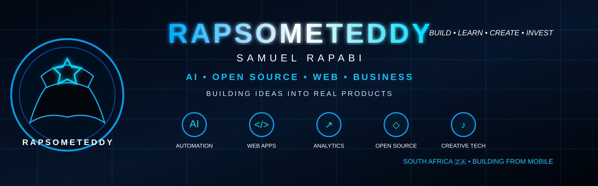

# 🧠 Rapsometeddy Ecosystem

<div align="center">



# RAPSOMETTEDY

### BUILD • LEARN • CREATE • INVEST

**One ecosystem. Multiple products. One identity.**

[](https://github.com/Rapsometeddy)

</div>

---

## 🌐 The Rapsometeddy Ecosystem

Rapsometeddy is the central home for a growing collection of software, automation, analytics, business and creative projects.

The goal is **not** to put every project into one giant codebase. Each product remains an independent repository, while the ecosystem provides a shared identity, navigation layer and — over time — shared services.

```
                         RAPSOMETTEDY
                              │
                    ┌─────────┴─────────┐
                    │   ECOSYSTEM HUB   │
                    │  Identity • Apps  │
                    └─────────┬─────────┘
                              │
        ┌──────────┬──────────┼──────────┬──────────┐
        ↓          ↓          ↓          ↓          ↓
     BUSINESS   FINANCE    CONTENT   ANALYTICS   CREATIVE
        │          │          │          │          │
   Business OS  ProfitMate  Content   Trader     VoiceStudio
                             Machine   Sports
                                       Predictor
        │
        └─────────────────────────────────────────┐
                                                  ↓
                                           HQ / Automation
                                           Telegram Bot
```

## 🚀 Products

| Product | Repository | Purpose |
|---|---|---|
| 🏢 **Business OS** | [rapsometeddy-business-os](https://github.com/Rapsometeddy/rapsometeddy-business-os) | Business operations and workflow management |
| 💰 **ProfitMate** | [-profitmate](https://github.com/Rapsometeddy/-profitmate) | Personal/business money and profit tooling |
| 📱 **Content Machine** | [rapsometeddy-content-machine](https://github.com/Rapsometeddy/rapsometeddy-content-machine) | Telegram-first content automation |
| 🤖 **HQ Bot** | [Rapsometeddyrapsometeddy-hq-bot](https://github.com/Rapsometeddy/Rapsometeddyrapsometeddy-hq-bot) | Telegram automation gateway |
| 📈 **Trader** | [Rapsometeddy-Trader-v1](https://github.com/Rapsometeddy/Rapsometeddy-Trader-v1) | Market analytics and backtesting |
| ⚽ **Sports Predictor** | [rapsometeddy-sports-predictor](https://github.com/Rapsometeddy/rapsometeddy-sports-predictor) | Statistical football analytics |
| 🎙️ **VoiceStudio** | [VoiceStudio](https://github.com/Rapsometeddy/VoiceStudio) | Voice and music experimentation |
| 🌐 **Website** | [website](https://github.com/Rapsometeddy/website) | Public web presence |
| 👤 **Profile** | [Rapsometeddy](https://github.com/Rapsometeddy/Rapsometeddy) | Ecosystem home and documentation |

## 🧩 Ecosystem Principles

### 1. Independent products
Every serious product keeps its own repository, deployment and release cycle.

### 2. Shared identity
Products use the Rapsometeddy ecosystem as their common brand and navigation layer.

### 3. Shared infrastructure where it makes sense
Authentication, user profiles, notifications, analytics and other common services can eventually be shared instead of rebuilt for every app.

### 4. Mobile-first
Projects should remain practical to build, operate and manage from Android where possible.

### 5. Build → Test → Learn → Improve
Small working products come before unnecessary complexity.

## 🗺️ Roadmap

- [x] Establish Rapsometeddy as the ecosystem home
- [x] Create a central product map
- [ ] Build the Rapsometeddy Hub dashboard
- [ ] Add unified navigation across products
- [ ] Introduce Rapsometeddy ID / shared authentication
- [ ] Add shared user profile
- [ ] Add ecosystem notifications
- [ ] Add product health/status dashboard
- [ ] Connect shared Supabase services where appropriate
- [ ] Create a public product directory
- [ ] Add an ecosystem API

## 🔐 Architecture Direction

The ecosystem will use a **hub-and-spoke** architecture:

- **Hub:** identity, navigation, shared services and ecosystem-level settings.
- **Products:** independent applications focused on one job.
- **Shared services:** authentication, database services and APIs only where there is a real benefit.
- **Repositories:** remain separate so one product can evolve without breaking the others.

This keeps Rapsometeddy scalable without turning the entire ecosystem into one fragile monolith.

---

<div align="center">

### ⚡ One identity. Many ideas. One ecosystem.

**Rapsometeddy — BUILD • LEARN • CREATE • INVEST**

</div>
